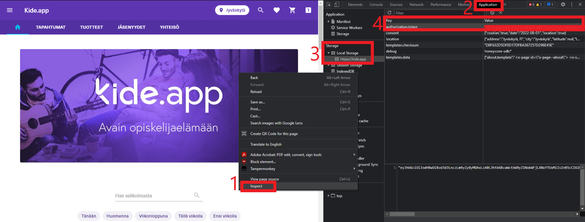

# Kide.App.Bot usage

1. Download [KideBot.ps1](https://gitlab.labranet.jamk.fi/AA3739/kide.app.bot/-/raw/main/KideBot.ps1?inline=false) and [key.txt](https://gitlab.labranet.jamk.fi/AA3739/kide.app.bot/-/raw/main/key.txt?inline=false)
2. Place them in the same folder
3. Paste your bearer token in key.txt, be sure to remove any leftover <> or ""
4. Run KideBot.ps1 with PowerShell (Right-click > Run with PowerShell. Obviously this requires an installation of PowerShell)
5. If the sales for your event haven't started, the bot waits until the moment they start.
6. After the sales have started, it will reserve the maximum amount of each different type of ticket possible.
7. After a refresh, the tickets should be in your shopping cart!

## How do I find my bearer token?

Start from the [kide.app](https://kide.app/) site.

1. Right click the page and select inspect
2. Select Application from the top bar.
3. Expand Local Storage, and select https://kide.app
4. You can find your bearer token at the value of authorization.token. Copy it and paste it to the key.txt file within the folder. 
5. Voilá! You're done. The script finds the key from the folder, this way you won't have to paste it again every time you use it.

